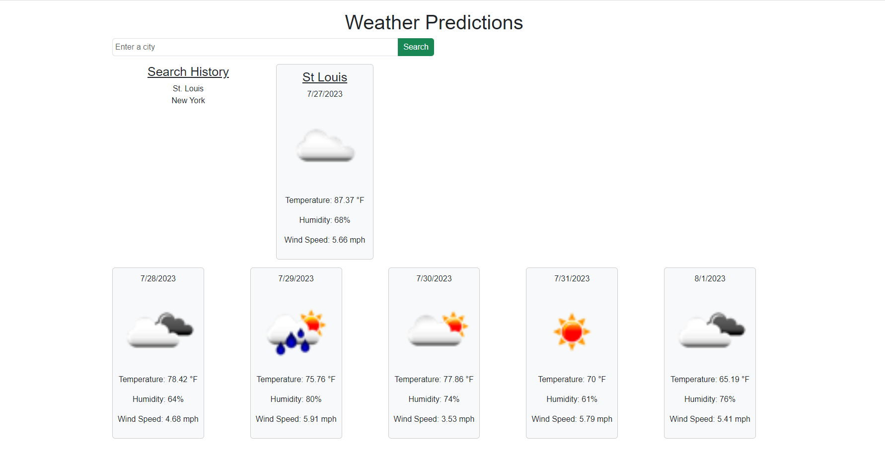
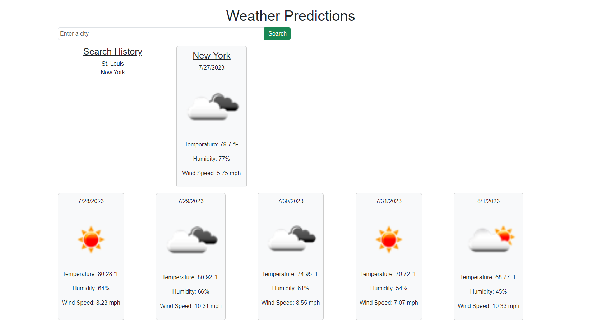
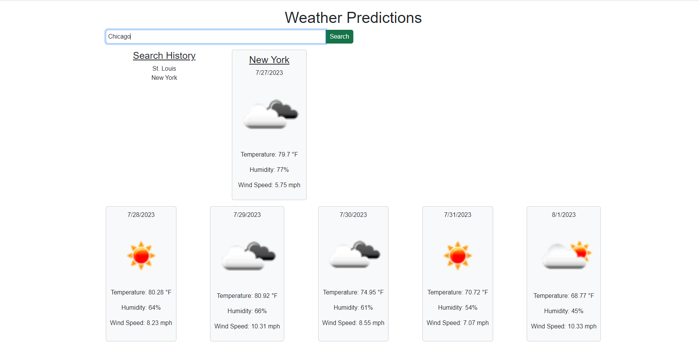
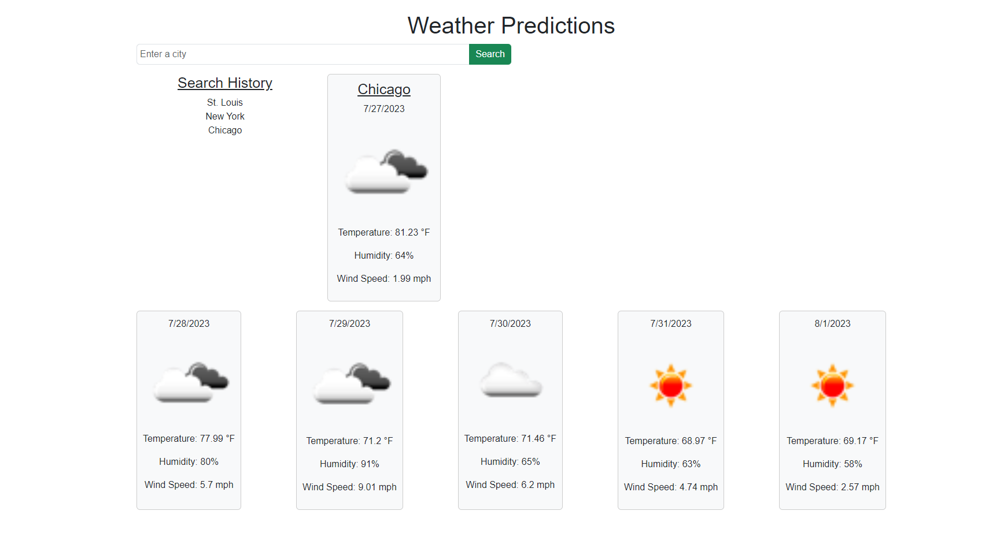

# Weather-Predictor
https://mlek10.github.io/Weather-Predictor/

## Description
The Weather Predictor project is a weather dashboard application that allows users to search for a city and view the current weather conditions and a 5-day forecast for that city. Additionally, the application maintains a search history, allowing users to quickly access previously searched cities.

## Usage
1. Search for a City
Type the name of the desired city in the box labeled "Enter a city."
Click the "Search" button.

2. View Current Weather Conditions
After searching for a city, the application will display the current weather conditions. This includes the city name, date, weather icon, temperature in Fahrenheit, humidity percentage, and wind speed in mph.

3. View Future Weather Conditions
After searching for a city, a 5-day forecast will be shown below the current weather conditions. Each forecast card will display the date, weather icon, temperature in Fahrenheit, humidity percentage, and wind speed in mph for that specific day.

4. Search History
The left-hand column labeled "Search History" will contain a list of previously searched cities.
Clicking on a city in the search history will trigger a new search for that city, displaying its current and future weather conditions.

## Technologies Used
The Weather Predictor application uses the following technologies:

HTML
CSS (Bootstrap 5.3.1)
JavaScript 
API- The application utilizes the OpenWeather API to fetch weather data for the searched cities.

